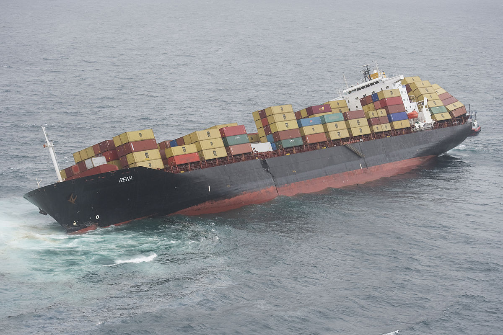

# k8s the hard way - terraform
*Disclaimer: this is - by no means - production grade material.*

:warning: All private keys/encryption tokens and other secrets are stored in the terraform
state & on disk; some are even displayed on screen.
Furthermore there are certain in-cluster security issues:
* K8s Pods reach the aws metadataservice
* IAM Roles set on ec2 instances/user instead of irsa
* ~~Dex idP clientSecrets are visible~~

This is an aws based k8s-the-hard-way setup (inspired by [Kelsey Hightower](https://github.com/kelseyhightower/kubernetes-the-hard-way)), solely deployed with terraform and
hacky shell scripts, triggered by cloud-init.

---
> The project developed itself to a playground for all of my k8s/aws tech related curiosity.
---

# Roadmap
- Clustersetup
  - [x] CoreDNS
  - [x] CNI Networking with ~~weave~~ calico
  - [ ] Static pods
  - [ ] Move away from shell-scripts to cloudinit
  - [ ] Switch from rhel8 to flatcar/talon/bottlerocket
  - [ ] binary checksum verification
  - [ ] `kube-bench` with a reasonable score
  - [ ] https://github.com/aws/amazon-vpc-cni-k8s
  - [x] Move the bastion LB for the k8s api to `aws_lb`  
    The Bastion Host has a nginx loadbalancing the k8s-api; This should be
    replaced by an aws network lb
  - [ ] Migrate the hacky shell scripts to ignition/afterburner

- Clusteraddons
  - [x] [aws cloud controller manager](https://github.com/kubernetes/cloud-provider-aws) (as external cloud provider in k8s)
  - [x] [aws-lb-controller](https://github.com/kubernetes-sigs/aws-load-balancer-controller) as ingress class
  - [x] [external_dns](https://github.com/kubernetes-sigs/external-dns) with route53 access
  - [x] [sealed-secrets](https://github.com/bitnami-labs/sealed-secrets) as secretstorage  
    With external private Key (from aws ssm parameter store) for external secrets
    like Github tokens, which should surive clusterrebuilds
- IdentityManagement
  - [x] Dex as idP with Github Backend for all login related Toosl (`kubectl`, argoCD)
  - [ ] replace ec2 IAM rules with [IRSA](https://aws.amazon.com/blogs/opensource/introducing-fine-grained-iam-roles-service-accounts/)
- Autoscaling
  - [ ] ...
  - [ ] scaling of nodes dependend on load -> karpenter
- Application
  - [x] ArgoCD

- Ungrouped
  - [ ] ImageScanWebook
  - [ ] Block aws metadata access from cluster
  - [ ] etcd autodiscovery (etcd in autoscalingroups)
  - [ ] bootstrap tokens
  - [ ] crossplane vs aws-controllers-k8s
  - [ ] kyverno vs gatekeeper/opa vs kubevious
  - [ ] cluster backup -> velero

# Implementation
## Hosts
Rhel8 Images are used for control- & workernodes with SELinux enabled.

## Network
The controller & worker nodes are evenly distributed among all availabe AZs:
- AZ 1a CIDR: `10.10.16.0/20`
- AZ 1b CIDR: `10.10.32.0/20`
- AZ 1c CIDR: `10.10.48.0/20`
- Service CIDR: `10.32.0.0/24`
- Cluster CIDR: `10.200.0.0/16`
- Cluster DNS: `10.32.0.53`

### calico
### open ToDos
- [ ] move to helm chart

### dex
intro in dex...
installing kubectl login plugin...

## open ToDos
- [ ] view only clusterrolebinding
- [ ] restore fine grained security groups

# Usage
## Get admin kubeconfig
Copy the kubeconfig from remote to local station:
`scp -J ec2-user@$(terraform output -raw bastion_ip_public) ec2-user@$(terraform output -raw first_controller_ip):admin.kubeconfig .`

